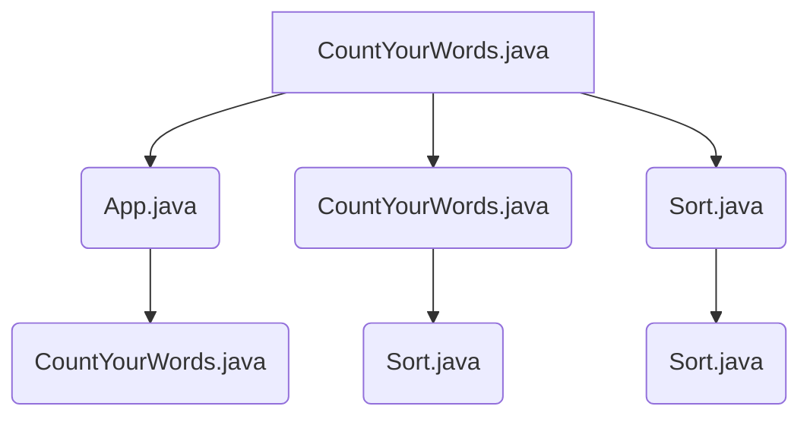

# Introduction to CountYourWords

## Introduction

CountYourWords is a Java project designed as a text parser that processes an input file (`input.txt`) to count words and their occurrences. The project adheres to specific constraints, including ignoring numbers, special characters, and case sensitivity. The goal of the project is to produce production-ready code with comprehensive testing and Test-Driven Development (TDD). Additionally, the application must be designed following SOLID principles and object-oriented programming practices.

### Project Structure

The CountYourWords project has a structured file tree as follows:

```
CountYourWords/
├── lib/
│   ├── hamcrest-core-1.3.jar
│   └── junit-4.13.2.jar
├── readme.md
├── src/
│   ├── main/
│   │   ├── App.java
│   │   ├── CountYourWords.java
│   │   ├── Pair.java
│   │   └── Sort.java
│   └── test/
│       ├── CountYourWordsTest.java
│       ├── SortTest.java
│       └── textTests/
│           ├── emptyFile.txt
│           ├── exampleFile.txt
│           ├── nonPeriodFile.txt
│           └── validFile.txt
```

### Key Components

#### 1. `readme.md`
This file provides a detailed overview of the project, including its description, constraints, and goals. It serves as the primary documentation for developers.

**Example Content:**
```markdown
# Project Description
I am creating a text parser in Java named CountYourWords.

# Constraints
- Numbers in the document are ignored and are not processed
- Other characters than words should be filtered out of the input, so ## or @ or !! are ignored
- You do not have to take in account strange combinations like: love4u or mail@address.nl,
combinations like these are out of scope for this assignment
- Next to showing the total number of words in the document, the number of occurrences of
each word is also calculated
- The total number of occurrences next to the word must be shown on screen one by one (in
lowercase)
- Counting the occurrences per word is case insensitive (so Matchbox, matchbox, and
MATCHBOX are all the same word)
- When printing the occurrences, the words must be in alphabetical order
- You cannot use a built-in .NET sort routine, so produce on of your own, it does not have to be
the fastest sort-routine as long as it is reliable end reusable.
- The document is a text file that will be read by your console app and has the fixed name:
input.txt

# Goal
- The code must be production code, use everything you would use in production. You are allowed to use third party components if required (except for the sorting)
- All classes can be in one .NET core console application (assembly), as long as you show clear separation
- Everything must be done using testing and TDD
- Use SOLID and object-oriented programming
```

#### 2. `CountYourWords.java`
This is the main class of the project, responsible for orchestrating the word counting process.

**Example Code:**
```java
import java.io.BufferedReader;
import java.io.FileReader;
import java.io.IOException;
import java.util.HashMap;

public class CountYourWords {
    public static void main(String[] args) {
        String fileName = "input.txt";
        HashMap<String, Integer> wordCounts = new HashMap<>();

        try (BufferedReader br = new BufferedReader(new FileReader(fileName))) {
            String line;
            while ((line = br.readLine()) != null) {
                String[] words = line.split("\\W+");
                for (String word : words) {
                    if (!word.isEmpty() && !Character.isDigit(word.charAt(0))) {
                        wordCounts.put(word.toLowerCase(), wordCounts.getOrDefault(word.toLowerCase(), 0) + 1);
                    }
                }
            }

            ArrayList<String> sortedWordCounts = Sort.sort(wordCounts);
            for (String entry : sortedWordCounts) {
                System.out.println(entry);
            }
        } catch (IOException e) {
            e.printStackTrace();
        }
    }
}
```

#### 3. `Sort.java`
This class contains a method to sort the word counts alphabetically.

**Example Code:**
```java
import java.util.ArrayList;

public class Sort {
    public static ArrayList<String> insertionSort(String[] words) {
        ArrayList<String> sortedWords = new ArrayList<>();
        for (String word : words) {
            int i = 0;
            while (i < sortedWords.size() && sortedWords.get(i).compareTo(word) < 0) {
                i++;
            }
            sortedWords.add(i, word);
        }
        return sortedWords;
    }

    public static ArrayList<String> sort(HashMap<String, Integer> wordCounts) {
        ArrayList<String> sortedWordCounts = new ArrayList<>();
        // Sort the words first
        ArrayList<String> sortedWords = insertionSort(wordCounts.keySet().toArray(new String[0]));

        // Now to add the values back
        for (String word : sortedWords) {
            String value = Integer.toString(wordCounts.get(word));
            String fString = word + " " + value;
            sortedWordCounts.add(fString);
        }

        return sortedWordCounts;
    }
}
```

### Mermaid Diagram

Below is a mermaid diagram illustrating the relationships and dependencies within the CountYourWords project:



### Conclusion

The CountYourWords project is a comprehensive text parser that processes an input file to count words and their occurrences. It adheres to specific constraints, uses TDD for development, and follows SOLID principles. The project structure includes essential files such as `readme.md`, `CountYourWords.java`, and `Sort.java`. The provided code snippets and mermaid diagram help in understanding the architecture and functionality of the project.

For more detailed information on each component, refer to the respective source files within the project directory.