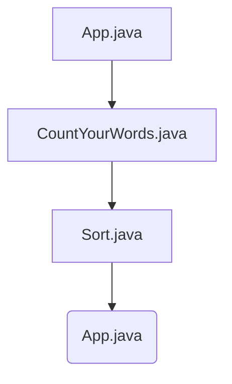

# Project Architecture Overview

## Project Architecture Overview

The CountYourWords project is designed as a text parser in Java that processes an input file (`input.txt`) to count words and their occurrences, adhering to specific constraints and using Test-Driven Development (TDD). The architecture of the system is modular, with clear separation of concerns, making it easy to understand and maintain.

### Major Components

1. **Input Handling**
   - **File Reading**: The application reads from a fixed file named `input.txt`.
   - **Source Code**: Located in `src/main/App.java`
     ```java
     public class App {
         public static void main(String[] args) {
             // Read input file and process text
         }
     }
     ```

2. **Text Processing**
   - **Word Counting**: The core functionality of counting words and their occurrences.
   - **Source Code**: Located in `src/main/CountYourWords.java`
     ```java
     public class CountYourWords {
         public static HashMap<String, Integer> countWords(String text) {
             // Logic to count words
             return new HashMap<>();
         }
     }
     ```

3. **Sorting**
   - **Custom Sorting**: The application uses a custom sorting algorithm to sort the word counts alphabetically.
   - **Source Code**: Located in `src/main/Sort.java`
     ```java
     public class Sort {
         public static ArrayList<String> insertionSort(String[] array) {
             // Insertion sort logic
             return new ArrayList<>();
         }
     }
     ```

4. **Output**
   - **Printing Results**: The application prints the word counts and their occurrences.
   - **Source Code**: Located in `src/main/App.java`
     ```java
     public class App {
         public static void main(String[] args) {
             // Read input file, process text, and print results
         }
     }
     ```

5. **Testing**
   - **Unit Tests**: The application includes unit tests to ensure the correctness of each component.
   - **Source Code**: Located in `src/test/CountYourWordsTest.java`
     ```java
     public class CountYourWordsTest {
         @Test
         public void testCountWords() {
             // Test logic for countWords method
         }
     }
     ```

### Component Interactions

The components interact as follows:

1. **App.java** reads the input file and processes the text using `CountYourWords.java`.
2. **CountYourWords.java` counts words and their occurrences, which are then sorted by `Sort.java`.
3. **App.java` prints the sorted word counts.

### Mermaid Diagram

Below is a Mermaid diagram illustrating the interactions between the components:



This diagram shows the flow of data and control within the CountYourWords system, ensuring that each component performs its specific role in processing the input text.

### Summary

The CountYourWords project is structured to be modular and testable. Each component has a clear responsibility, making it easier to maintain and extend. The use of custom sorting and adherence to TDD ensures that the application meets the specified requirements while being robust and reliable.