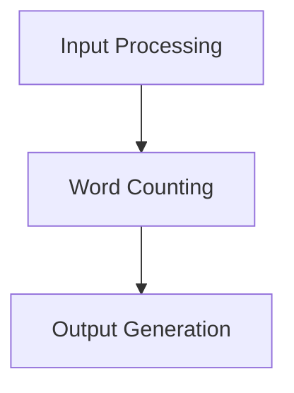

# Core System Components

### Core System Components

The CountYourWords application is composed of several key components that work together to process input text, count words, and generate output. Below, we will detail each component in depth.

#### Input Processing

Input processing involves reading the contents of `input.txt` and preparing it for further processing. This step ensures that only valid words are considered, ignoring numbers and special characters.

**Code Snippet:**
```java
// src/main/CountYourWords.java
public class CountYourWords {
    public static void main(String[] args) throws IOException {
        String input = readFile("input.txt");
        List<String> words = preprocess(input);
        // Further processing...
    }

    private static String readFile(String fileName) throws IOException {
        return new String(Files.readAllBytes(Paths.get(fileName)));
    }

    private static List<String> preprocess(String input) {
        return Arrays.asList(input.replaceAll("[^a-zA-Z ]", "").toLowerCase().split("\\s+"));
    }
}
```

**Explanation:**
- `readFile`: Reads the contents of `input.txt` and returns it as a string.
- `preprocess`: Removes non-alphabetic characters, converts the text to lowercase, and splits it into individual words.

#### Word Counting

Word counting involves counting the occurrences of each word in the preprocessed list. This step uses a `HashMap` to store word counts efficiently.

**Code Snippet:**
```java
// src/main/CountYourWords.java
private static Map<String, Integer> countWords(List<String> words) {
    Map<String, Integer> wordCounts = new HashMap<>();
    for (String word : words) {
        wordCounts.put(word, wordCounts.getOrDefault(word, 0) + 1);
    }
    return wordCounts;
}
```

**Explanation:**
- `countWords`: Iterates through the list of words and updates a `HashMap` with the count of each word.

#### Output Generation

Output generation involves sorting the word counts alphabetically and formatting them for display. This step uses a custom sort algorithm to ensure reliability and reusability.

**Code Snippet:**
```java
// src/main/Sort.java
public class Sort {
    public static ArrayList<String> insertionSort(String[] words) {
        ArrayList<String> sortedWords = new ArrayList<>(Arrays.asList(words));
        for (int i = 1; i < sortedWords.size(); i++) {
            String key = sortedWords.get(i);
            int j = i - 1;
            while (j >= 0 && sortedWords.get(j).compareTo(key) > 0) {
                sortedWords.set(j + 1, sortedWords.get(j));
                j--;
            }
            sortedWords.set(j + 1, key);
        }
        return sortedWords;
    }
}
```

**Explanation:**
- `insertionSort`: Implements the insertion sort algorithm to sort an array of words alphabetically.

#### Mermaid Diagram

Below is a mermaid diagram that illustrates the flow of data through the core components:



**Explanation:**
- **Input Processing**: Reads and preprocesses `input.txt`.
- **Word Counting**: Counts occurrences of each word.
- **Output Generation**: Sorts the word counts alphabetically and formats them for display.

### Conclusion

The CountYourWords application is designed with a clear separation of concerns, making it modular and easy to maintain. Each component has a specific responsibility, ensuring that the system is scalable and extensible.