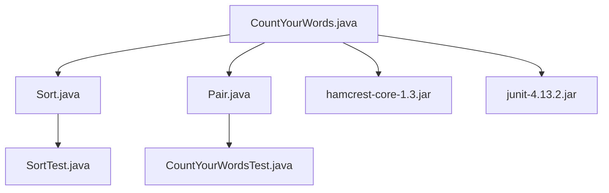

# Dependencies and Libraries

### Dependencies and Libraries

The CountYourWords project relies on several external libraries to facilitate its functionality. These libraries are essential for testing and assertions, ensuring that the application behaves as expected during development and production.

#### Hamcrest Core (hamcrest-core-1.3.jar)

**Role:** Hamcrest is a framework for writing matcher objects in Java. It provides a more readable and expressive way to write assertions compared to traditional JUnit matchers.

**Version:** 1.3

**Usage Example:**
```java
import static org.hamcrest.MatcherAssert.assertThat;
import static org.hamcrest.Matchers.*;

public class CountYourWordsTest {
    @Test
    public void testWordCount() {
        // Arrange
        String input = "hello world hello";
        Map<String, Integer> expectedCounts = new HashMap<>();
        expectedCounts.put("hello", 2);
        expectedCounts.put("world", 1);

        // Act
        Map<String, Integer> actualCounts = CountYourWords.countWords(input);

        // Assert
        assertThat(actualCounts, is(expectedCounts));
    }
}
```

#### JUnit (junit-4.13.2.jar)

**Role:** JUnit is a popular testing framework for Java applications. It allows developers to write and run repeatable tests.

**Version:** 4.13.2

**Usage Example:**
```java
import org.junit.Test;
import static org.junit.Assert.*;

public class CountYourWordsTest {
    @Test
    public void testWordCount() {
        // Arrange
        String input = "hello world hello";
        Map<String, Integer> expectedCounts = new HashMap<>();
        expectedCounts.put("hello", 2);
        expectedCounts.put("world", 1);

        // Act
        Map<String, Integer> actualCounts = CountYourWords.countWords(input);

        // Assert
        assertEquals(expectedCounts, actualCounts);
    }
}
```

### Summary

The CountYourWords project utilizes two key external libraries: Hamcrest Core and JUnit. These libraries are crucial for testing the application's functionality and ensuring that it meets the specified requirements. By leveraging these tools, developers can write more readable and maintainable test cases, thereby improving the overall quality of the project.

### Mermaid Diagram

Below is a simple Mermaid diagram illustrating the dependency relationships within the CountYourWords project:



This diagram shows how the main application classes depend on each other and on the external libraries for testing and assertions.