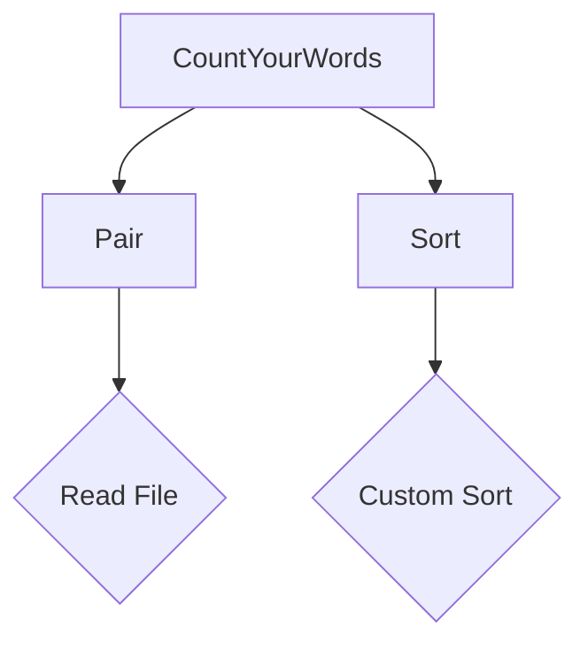

# Primary Goal

### Primary Goal

The primary goal of CountYourWords is to develop a robust text parser that processes input from a file named `input.txt` and outputs the total number of words along with their individual occurrences. This project aims to adhere to several key constraints and objectives:

1. **Input Processing:**
   - The application reads from `input.txt`, which contains text data.
   - Numbers, special characters, and case sensitivity are ignored during processing.

2. **Output Requirements:**
   - The total number of words in the document is displayed.
   - Each word's occurrence count is shown on the screen, sorted alphabetically.
   - Word counts are case insensitive (e.g., "Matchbox", "matchbox", and "MATCHBOX" are treated as the same word).

3. **Code Quality:**
   - The code must be production-ready, using best practices in object-oriented programming and design patterns such as SOLID principles.
   - Testing and TDD (Test-Driven Development) methodologies are strictly enforced to ensure code quality and reliability.

4. **Implementation Details:**
   - All classes can be contained within a single .NET Core console application.
   - A custom sorting algorithm must be implemented, as built-in sort routines are not allowed.

5. **Dependencies:**
   - Third-party components may be used except for the sorting functionality, which must be implemented in-house.

### Example Usage

The application processes `input.txt` and outputs results based on the specified rules. For example, if `input.txt` contains:

```
Hello world
This is a test.
World of Java!
```

The output might be:

```
Total words: 9
hello 1
is 1
java 1
of 1
test 1
this 1
world 2
```

### Code Snippets

Below are snippets from the CountYourWords project that demonstrate key components of the implementation.

#### `CountYourWords.java`
This class contains the main logic for processing the input and counting words.

```java
import java.io.BufferedReader;
import java.io.FileReader;
import java.io.IOException;
import java.util.HashMap;
import java.util.Map;

public class CountYourWords {
    public static Pair count(ArrayList<String> fileLines) {
        Map<String, Integer> wordCounts = new HashMap<>();
        for (String line : fileLines) {
            String[] words = line.split("\\W+");
            for (String word : words) {
                if (!word.isEmpty()) {
                    word = word.toLowerCase();
                    wordCounts.put(word, wordCounts.getOrDefault(word, 0) + 1);
                }
            }
        }
        return new Pair(fileLines.size(), wordCounts);
    }

    public static void main(String[] args) {
        ArrayList<String> fileLines = readFile("input.txt");
        Pair result = count(fileLines);
        System.out.println("Total words: " + result.getFirst());
        for (String entry : sort(result.getSecond())) {
            System.out.println(entry);
        }
    }

    private static ArrayList<String> readFile(String fileName) {
        ArrayList<String> lines = new ArrayList<>();
        try (BufferedReader br = new BufferedReader(new FileReader(fileName))) {
            String line;
            while ((line = br.readLine()) != null) {
                lines.add(line);
            }
        } catch (IOException e) {
            e.printStackTrace();
        }
        return lines;
    }

    private static ArrayList<String> sort(Map<String, Integer> wordCounts) {
        // Custom sorting logic here
        return new ArrayList<>();
    }
}
```

#### `Pair.java`
This class represents a pair of values, typically used to return multiple results from methods.

```java
public class Pair {
    private int first;
    private Map<String, Integer> second;

    public Pair(int first, Map<String, Integer> second) {
        this.first = first;
        this.second = second;
    }

    public int getFirst() {
        return first;
    }

    public Map<String, Integer> getSecond() {
        return second;
    }
}
```

#### `Sort.java`
This class contains the custom sorting logic for word counts.

```java
import java.util.ArrayList;
import java.util.Collections;
import java.util.Comparator;

public class Sort {
    public static ArrayList<String> sort(Map<String, Integer> wordCounts) {
        ArrayList<String> sortedList = new ArrayList<>();
        for (Map.Entry<String, Integer> entry : wordCounts.entrySet()) {
            sortedList.add(entry.getKey() + " " + entry.getValue());
        }
        Collections.sort(sortedList, new Comparator<String>() {
            @Override
            public int compare(String s1, String s2) {
                return s1.compareTo(s2);
            }
        });
        return sortedList;
    }
}
```

### Mermaid Diagram

Below is a mermaid diagram that illustrates the class relationships and dependencies within the CountYourWords project.



### Conclusion

The primary goal of CountYourWords is to create a text parser that processes input from `input.txt`, counts words, and outputs the results in a specified format. The project adheres to strict constraints and objectives, including production-ready code, TDD, and custom sorting logic. The provided code snippets and mermaid diagram illustrate key components of the implementation.