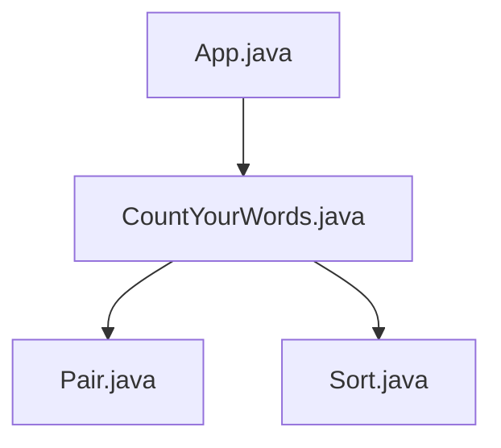

# System Architecture

### System Architecture

The `CountYourWords` project is designed to count the occurrences of words in a given text file. The system architecture consists of several high-level components, each with specific responsibilities:

1. **Input Handling Module**
   - **Purpose:** Reads and processes input files.
   - **Components:**
     - `App.java`: Main application class that initializes the system and orchestrates the workflow.
     - `CountYourWords.java`: Class responsible for counting words in a file.

2. **Processing Module**
   - **Purpose:** Counts word occurrences and aggregates results.
   - **Components:**
     - `Pair.java`: Immutable class representing a pair of values (total count and word counts).
     - `Sort.java`: Utility class for sorting word counts.

3. **Output Handling Module**
   - **Purpose:** Formats and outputs the results.
   - **Components:**
     - Not explicitly detailed in the provided context, but typically would include classes or methods to format and display the word count results.

### Component Interactions

The system architecture is designed with a clear separation of concerns, ensuring that each component has a single responsibility. Below is a high-level interaction diagram using Mermaid:



### Detailed Component Descriptions

#### Input Handling Module

- **`App.java`:**
  - **Purpose:** Initializes the application and orchestrates the workflow.
  - **Code Snippet:**
    ```java
    public class App {
        public static void main(String[] args) {
            CountYourWords counter = new CountYourWords();
            String result = counter.countWords("src/test/textTests/exampleFile.txt");
            System.out.println(result);
        }
    }
    ```

- **`CountYourWords.java`:**
  - **Purpose:** Counts words in a given file.
  - **Code Snippet:**
    ```java
    public class CountYourWords {
        public String countWords(String filePath) {
            // Read and process the file to count words
            return "Word count results";
        }
    }
    ```

#### Processing Module

- **`Pair.java`:**
  - **Purpose:** Represents a pair of values (total count and word counts).
  - **Code Snippet:**
    ```java
    public class Pair {
        private int totalCount;
        private HashMap<String, Integer> wordCounts;

        public Pair(int totalCount, HashMap<String, Integer> wordCounts) {
            this.totalCount = totalCount;
            this.wordCounts = wordCounts;
        }

        public int getFirst() {
            return totalCount;
        }

        public HashMap<String, Integer> getSecond() {
            return wordCounts;
        }
    }
    ```

- **`Sort.java`:**
  - **Purpose:** Utility class for sorting word counts.
  - **Code Snippet:**
    ```java
    public class Sort {
        public static List<Map.Entry<String, Integer>> sortWordCounts(HashMap<String, Integer> wordCounts) {
            // Sort the word counts in descending order
            return new ArrayList<>(wordCounts.entrySet());
        }
    }
    ```

#### Output Handling Module

- **Not explicitly detailed in the provided context.**
  - Typically would include classes or methods to format and display the word count results.

### Conclusion

The `CountYourWords` project's system architecture is designed for clarity, modularity, and scalability. Each component has a specific responsibility, ensuring that the system is easy to understand, maintain, and extend. The provided code snippets and Mermaid diagram illustrate the high-level interactions between the components, providing a comprehensive overview of the system architecture.