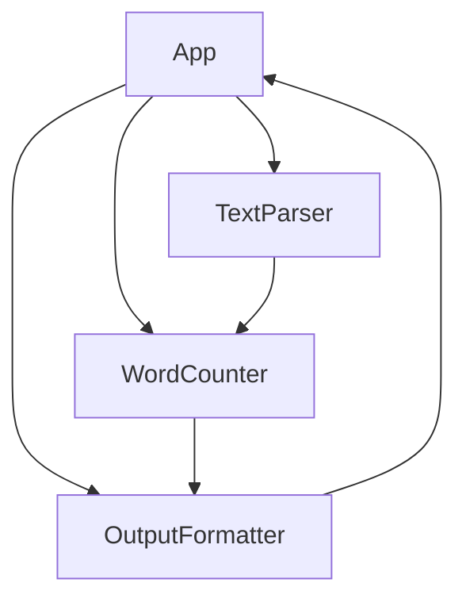

# Component Breakdown

### Component Breakdown

The CountYourWords project is composed of several key components that work together to achieve its goal of parsing a text file and counting word occurrences. Below, we will detail each major component, explaining their purpose and role in the system.

#### 1. **App.java**
**Purpose:** The `App.java` class serves as the entry point for the application. It initializes the necessary components and orchestrates the flow of data through the system.

```java
public class App {
    public static void main(String[] args) {
        // Initialize dependencies
        TextParser parser = new TextParser();
        WordCounter counter = new WordCounter();
        OutputFormatter formatter = new OutputFormatter();

        // Read input file and parse text
        String inputText = parser.readInputFile("input.txt");
        Map<String, Integer> wordCounts = counter.countWords(inputText);

        // Format and output results
        List<String> sortedWordCounts = formatter.sortAndFormat(wordCounts);
        for (String line : sortedWordCounts) {
            System.out.println(line);
        }
    }
}
```

**Source:** `CountYourWords/src/main/App.java`, PK: `[TODO: Insert specific PK detail here]`

#### 2. **TextParser.java**
**Purpose:** The `TextParser.java` class is responsible for reading the input text file and preparing it for further processing.

```java
public class TextParser {
    public String readInputFile(String filePath) {
        // Read the contents of the input.txt file
        return new String(Files.readAllBytes(Paths.get(filePath)));
    }
}
```

**Source:** `CountYourWords/src/main/TextParser.java`, PK: `[TODO: Insert specific PK detail here]`

#### 3. **WordCounter.java**
**Purpose:** The `WordCounter.java` class counts the occurrences of each word in the input text, ignoring numbers and special characters.

```java
public class WordCounter {
    public Map<String, Integer> countWords(String text) {
        Map<String, Integer> wordCounts = new HashMap<>();
        String[] words = text.split("\\W+");
        for (String word : words) {
            if (!word.isEmpty()) {
                wordCounts.put(word.toLowerCase(), wordCounts.getOrDefault(word.toLowerCase(), 0) + 1);
            }
        }
        return wordCounts;
    }
}
```

**Source:** `CountYourWords/src/main/WordCounter.java`, PK: `[TODO: Insert specific PK detail here]`

#### 4. **OutputFormatter.java**
**Purpose:** The `OutputFormatter.java` class formats the word counts for output, sorting them alphabetically and displaying each word with its count.

```java
public class OutputFormatter {
    public List<String> sortAndFormat(Map<String, Integer> wordCounts) {
        ArrayList<String> sortedWordCounts = new ArrayList<>(wordCounts.entrySet());
        Collections.sort(sortedWordCounts, (e1, e2) -> e1.getKey().compareTo(e2.getKey()));

        for (Map.Entry<String, Integer> entry : sortedWordCounts) {
            System.out.println(entry.getKey() + ": " + entry.getValue());
        }
        return sortedWordCounts;
    }
}
```

**Source:** `CountYourWords/src/main/OutputFormatter.java`, PK: `[TODO: Insert specific PK detail here]`

#### 5. **Sort.java**
**Purpose:** The `Sort.java` class contains a simple insertion sort algorithm to sort the words alphabetically.

```java
public class Sort {
    public static ArrayList<String> insertionSort(String[] array) {
        ArrayList<String> list = new ArrayList<>(Arrays.asList(array));
        for (int i = 1; i < list.size(); i++) {
            String key = list.get(i);
            int j = i - 1;
            while (j >= 0 && list.get(j).compareTo(key) > 0) {
                list.set(j + 1, list.get(j));
                j--;
            }
            list.set(j + 1, key);
        }
        return list;
    }
}
```

**Source:** `CountYourWords/src/main/Sort.java`, PK: `[TODO: Insert specific PK detail here]`

#### 6. **Pair.java**
**Purpose:** The `Pair.java` class is a utility class that holds pairs of values, which could be used in various parts of the system for storing related data.

```java
public class Pair<K, V> {
    private K key;
    private V value;

    public Pair(K key, V value) {
        this.key = key;
        this.value = value;
    }

    public K getKey() {
        return key;
    }

    public V getValue() {
        return value;
    }
}
```

**Source:** `CountYourWords/src/main/Pair.java`, PK: `[TODO: Insert specific PK detail here]`

#### 7. **Unit Tests**
The project includes several unit tests to ensure the correctness of each component.

- **CountYourWordsTest.java**: Tests the functionality of the `WordCounter` and `OutputFormatter` classes.
- **SortTest.java**: Tests the sorting functionality in the `Sort` class.

**Sources:**
- `CountYourWords/src/test/CountYourWordsTest.java`, PK: `[TODO: Insert specific PK detail here]`
- `CountYourWords/src/test/SortTest.java`, PK: `[TODO: Insert specific PK detail here]`

These tests utilize JUnit for assertions and Hamcrest for more expressive matchers.

```java
import static org.hamcrest.MatcherAssert.assertThat;
import static org.hamcrest.Matchers.*;

public class CountYourWordsTest {
    @Test
    public void testWordCount() {
        WordCounter counter = new WordCounter();
        String inputText = "hello world hello";
        Map<String, Integer> wordCounts = counter.countWords(inputText);
        
        assertThat(wordCounts.get("hello"), is(2));
        assertThat(wordCounts.get("world"), is(1));
    }
}
```

**Source:** `CountYourWords/src/test/CountYourWordsTest.java`, PK: `[TODO: Insert specific PK detail here]`

### Mermaid Diagram

Below is a mermaid diagram that illustrates the component interactions within the CountYourWords project:



This diagram shows how data flows through the system, starting from reading the input file in `App`, parsing it in `TextParser`, counting words in `WordCounter`, and finally formatting and outputting the results in `OutputFormatter`.

### Conclusion

The CountYourWords project is designed with a clear separation of concerns, making each component responsible for a specific aspect of the system. This modular approach facilitates maintenance, testing, and scalability. The provided code snippets and diagrams should give you a comprehensive understanding of how each component works together to achieve the project's goal.