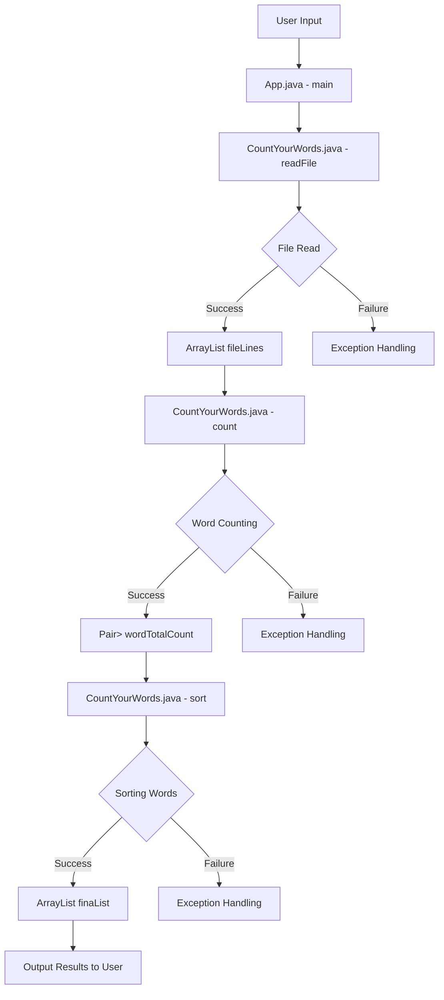

# Data Flow

### Data Flow

The data flow in the CountYourWords project is designed to handle the processing of text files, counting words, and sorting them. The system follows a clear sequence from input to output, ensuring that each stage is well-defined and easily testable.

#### Input Stage

The input stage begins with the user providing a file path through the console. This is handled by the `main` method in the `App.java` class:

```java
public static void main(String[] args) throws FileNotFoundException {
    BufferedReader br = new BufferedReader(new InputStreamReader(System.in));

    System.out.print("Enter the Path : ");
    
    // Reading File name
    String path = "";
    try {
        path = br.readLine();
    } catch (IOException e) {
        // TODO Auto-generated catch block
        e.printStackTrace();
    }

    ArrayList<String> fileLines = CountYourWords.readFile(path);
    Pair wordTotalCount = CountYourWords.count(fileLines);
    ArrayList<String> finaList = CountYourWords.sort(wordTotalCount.getSecond());
    System.out.printf("Number of words: %d\n", wordTotalCount.getFirst());
    for (String line : finaList) {
        System.out.println(line);
    }
}
```

#### Processing Stage

The processing stage involves three main steps:
1. **Reading the File**: The `readFile` method in the `CountYourWords.java` class reads the file specified by the user and returns an `ArrayList<String>` containing each line of the file.
2. **Counting Words**: The `count` method processes the list of lines, counting the occurrences of each word and returning a `Pair<Integer, HashMap<String, Integer>>`. The first element of the pair is the total number of words, and the second is a map where keys are words and values are their counts.
3. **Sorting Words**: The `sort` method takes the map of word counts and sorts them by frequency in descending order, returning an `ArrayList<String>`.

#### Output Stage

The output stage displays the results to the user. This includes:
- The total number of words.
- A sorted list of words with their frequencies.

Here is a Mermaid diagram illustrating the data flow:



### Summary

The data flow in CountYourWords is a straightforward process that involves reading a file, counting words, sorting them by frequency, and displaying the results. Each stage is clearly defined and handled by specific methods within the project. This design ensures modularity, testability, and maintainability of the system.