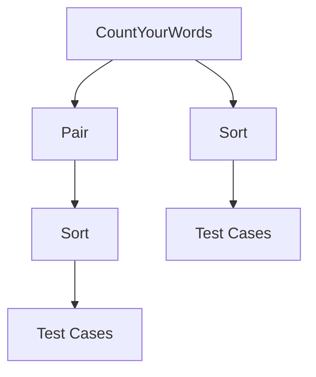

# Integration Points

### Integration Points

In this section, we will identify and describe any integration points between different components or external systems within the CountYourWords project. These integration points are crucial for understanding how various parts of the system interact with each other and with external resources.

#### Internal Component Integration

The primary internal component in CountYourWords is the `CountYourWords` class, which handles the main logic for counting words in a text file. This class interacts with several other components:

1. **Pair Class**: The `Pair` class is used to store and return results from word count operations. It encapsulates two values: a total count of words and a HashMap mapping each word to its frequency.

   ```java
   public final class Pair {
       private final int totalCount;
       private final HashMap<String, Integer> wordCounts;

       public Pair(int first, HashMap<String, Integer> second) {
           this.totalCount = first;
           this.wordCounts = second;
       }

       public int getFirst() {
           return totalCount;
       }

       public HashMap<String, Integer> getSecond() {
           return wordCounts;
       }
   }
   ```

2. **Sort Class**: The `Sort` class is responsible for sorting the results based on word frequency. It takes a `Pair` object as input and returns a sorted list of words.

   ```java
   public class Sort {
       public List<Map.Entry<String, Integer>> sort(Pair pair) {
           List<Map.Entry<String, Integer>> entries = new ArrayList<>(pair.getSecond().entrySet());
           Collections.sort(entries, (e1, e2) -> e2.getValue().compareTo(e1.getValue()));
           return entries;
       }
   }
   ```

#### External System Integration

CountYourWords interacts with external systems primarily through file operations. The project includes several test files located in the `src/test/textTests` directory:

- **emptyFile.txt**: An empty file used to test edge cases.
- **exampleFile.txt**: A sample text file containing words for word count.
- **nonPeriodFile.txt**: A file without periods, which might affect word separation logic.
- **validFile.txt**: A valid text file with proper formatting.

These files are read by the `CountYourWords` class to perform word counting operations. The project also includes test cases in the `src/test/java/CountYourWordsTest.java` and `src/test/java/SortTest.java` files, which utilize these external resources to validate the functionality of the system.

#### Integration Diagram

To better visualize the integration points within CountYourWords, a Mermaid diagram can be used:



This diagram shows the flow of data and control within the CountYourWords system, highlighting how `CountYourWords` interacts with the `Pair` and `Sort` classes, as well as external test cases.

### Conclusion

In summary, the integration points in CountYourWords are primarily internal component interactions (e.g., between `CountYourWords`, `Pair`, and `Sort`) and external system interactions (e.g., file operations for word counting). Understanding these integration points is essential for comprehending how different parts of the system work together to achieve its overall functionality.