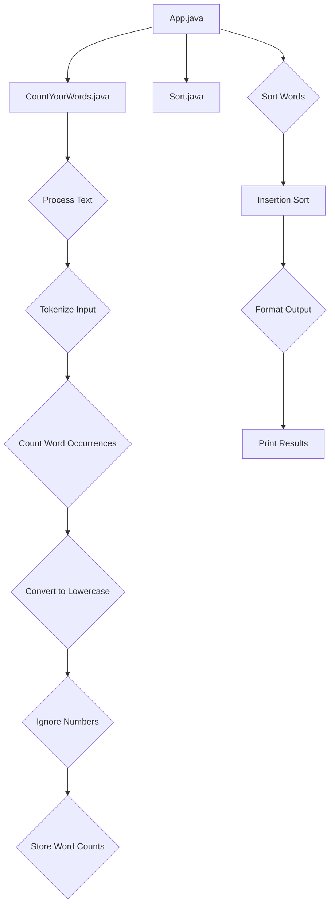

# Project Architecture Overview

### Project Architecture Overview

CountYourWords is a Java project designed to parse a text file (`input.txt`) and count the occurrences of each word. The project adheres to specific constraints, such as ignoring numbers, special characters, and case sensitivity. Below is an overview of the major components and their interactions within the CountYourWords project.

#### Key Components

1. **Input Handling**
   - **File Reading**: The application reads from `input.txt` using standard Java file handling mechanisms.
   - **Source File**: `src/main/App.java`
     ```java
     public class App {
         public static void main(String[] args) {
             // Code to read input.txt and process the text
         }
     }
     ```

2. **Text Processing**
   - **Word Tokenization**: The text is tokenized into individual words, ignoring numbers and special characters.
   - **Source File**: `src/main/CountYourWords.java`
     ```java
     public class CountYourWords {
         public static HashMap<String, Integer> processText(String input) {
             // Code to tokenize the input and count word occurrences
         }
     }
     ```

3. **Sorting**
   - **Custom Sorting Algorithm**: A custom insertion sort algorithm is implemented to sort words alphabetically.
   - **Source File**: `src/main/Sort.java`
     ```java
     public class Sort {
         public static ArrayList<String> insertionSort(String[] array) {
             // Code for insertion sort
         }
     }
     ```

4. **Output**
   - **Formatted Output**: The sorted word counts are formatted and printed to the console.
   - **Source File**: `src/main/App.java`
     ```java
     public class App {
         public static void main(String[] args) {
             // Code to read input.txt, process text, sort, and print results
         }
     }
     ```

5. **Testing**
   - **Unit Tests**: JUnit tests are provided to ensure the correctness of each component.
   - **Source File**: `src/test/CountYourWordsTest.java`
     ```java
     import org.junit.Test;
     import static org.junit.Assert.*;

     public class CountYourWordsTest {
         @Test
         public void testProcessText() {
             // Test cases for processText method
         }
     }
     ```

#### Component Interactions

The major components interact as follows:

1. **App.java**
   - Reads `input.txt`.
   - Calls `CountYourWords.processText()` to count word occurrences.
   - Calls `Sort.insertionSort()` to sort the words alphabetically.
   - Prints the sorted word counts.

2. **CountYourWords.java**
   - Tokenizes the input text into individual words.
   - Counts the occurrences of each word, ignoring case sensitivity and numbers.

3. **Sort.java**
   - Implements a custom insertion sort algorithm to sort words alphabetically.

4. **Test Files**
   - Contains JUnit tests to validate the functionality of `CountYourWords` and `Sort`.

#### Mermaid Diagram

Below is a Mermaid diagram illustrating the interactions between the major components:



This diagram shows the flow of data and control within the CountYourWords project, highlighting how each component contributes to the overall functionality.

#### Dependencies

The project depends on the following libraries:

- `hamcrest-core-1.3.jar`
- `junit-4.13.2.jar`

These dependencies are located in the `lib` directory of the project.

### Conclusion

This section provides a high-level overview of the CountYourWords project architecture, detailing its major components and their interactions. The project is structured to ensure robustness through testing and adherence to specific constraints, making it suitable for production use.