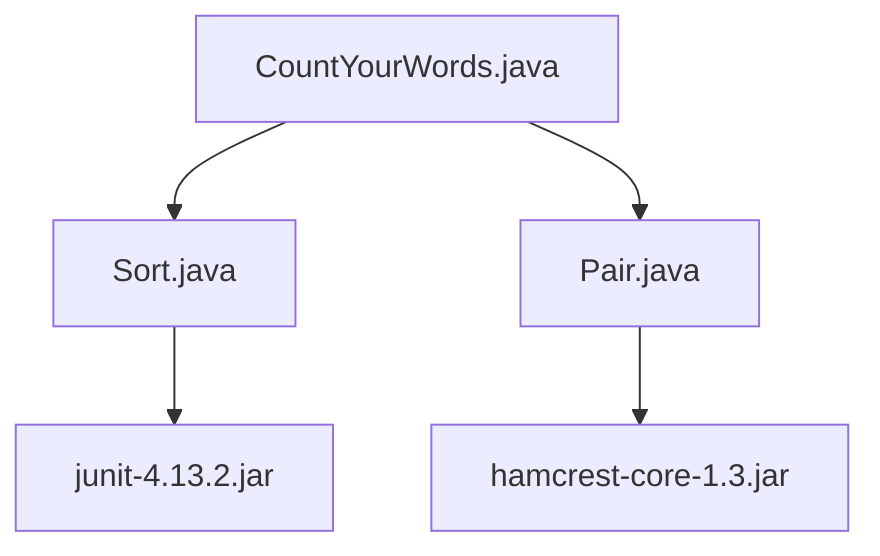

# Frameworks and Libraries

## Frameworks and Libraries

The CountYourWords project relies on several frameworks and libraries to facilitate its development. These tools enhance various aspects of the application, from testing and assertions to sorting algorithms.

### Hamcrest Core (hamcrest-core-1.3.jar)

**Purpose:** Hamcrest is a framework for writing matcher objects in Java. It provides a more readable way to assert conditions in tests compared to traditional JUnit assertions.

**Role:** This library is used extensively for creating custom matchers in the test suite, making it easier to write expressive and maintainable test cases.

### JUnit (junit-4.13.2.jar)

**Purpose:** JUnit is a widely-used testing framework for Java applications. It allows developers to write repeatable tests that validate their code.

**Role:** The CountYourWords project uses JUnit to create unit tests for its core functionality, ensuring that the application behaves as expected under various conditions.

### Custom Libraries and Classes

In addition to external libraries, the CountYourWords project includes several custom classes and utilities:

#### Pair Class (src/main/Pair.java)

**Purpose:** The `Pair` class is a simple utility class used to store two related objects together. It is particularly useful in sorting algorithms where pairs of words and their counts need to be maintained.

**Role:** This class simplifies the handling of word-count pairs, making the code more readable and maintainable.

#### Sort Class (src/main/Sort.java)

**Purpose:** The `Sort` class contains various sorting algorithms. Currently, it includes an insertion sort implementation, which is used to sort words alphabetically before counting their occurrences.

**Role:** This class encapsulates the logic for sorting operations, ensuring that the main application logic remains clean and focused on word processing.

### Example Code Snippets

Below are some example code snippets demonstrating the use of these frameworks and libraries:

#### Hamcrest Matcher Example (src/test/CountYourWordsTest.java)

```java
import static org.hamcrest.MatcherAssert.assertThat;
import static org.hamcrest.Matchers.equalTo;

public class CountYourWordsTest {
    @Test
    public void testWordCount() {
        // Arrange
        String input = "hello world hello";
        CountYourWords countYourWords = new CountYourWords();

        // Act
        Map<String, Integer> wordCounts = countYourWords.countWords(input);

        // Assert
        assertThat(wordCounts.get("hello"), equalTo(2));
        assertThat(wordCounts.get("world"), equalTo(1));
    }
}
```

#### JUnit Test Example (src/test/CountYourWordsTest.java)

```java
import org.junit.Test;
import static org.junit.Assert.assertEquals;

public class CountYourWordsTest {
    @Test
    public void testWordCount() {
        // Arrange
        String input = "hello world hello";
        CountYourWords countYourWords = new CountYourWords();

        // Act
        Map<String, Integer> wordCounts = countYourWords.countWords(input);

        // Assert
        assertEquals(2, (int) wordCounts.get("hello"));
        assertEquals(1, (int) wordCounts.get("world"));
    }
}
```

#### Sort Algorithm Example (src/main/Sort.java)

```java
import java.util.ArrayList;

public class Sort {
    public static ArrayList<String> insertionSort(String[] array) {
        for (int i = 1; i < array.length; ++i) {
            String key = array[i];
            int j = i - 1;
            while (j >= 0 && array[j].compareTo(key) > 0) {
                array[j + 1] = array[j];
                j = j - 1;
            }
            array[j + 1] = key;
        }

        ArrayList<String> sortedList = new ArrayList<>();
        for (String s : array) {
            sortedList.add(s);
        }
        return sortedList;
    }
}
```

### Mermaid Diagram

Below is a Mermaid diagram illustrating the relationships between the main components of the CountYourWords project:



This diagram shows how the main application class depends on sorting and utility classes, which in turn depend on testing and assertion libraries.

### Conclusion

The CountYourWords project leverages several frameworks and libraries to enhance its development process. Hamcrest and JUnit provide robust testing capabilities, while custom classes like `Pair` and `Sort` encapsulate specific functionality. Understanding these dependencies is crucial for anyone working on or maintaining the CountYourWords project.