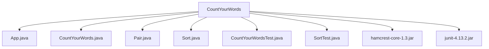

# Build Tools

## Build Tools

CountYourWords utilizes several build tools to compile and package the project. The primary build tool used is Maven, which manages dependencies, builds the project, and runs tests.

### Setting Up Maven

To set up Maven for CountYourWords, follow these steps:

1. **Install Java**: Ensure that Java Development Kit (JDK) 8 or later is installed on your system.
2. **Download and Install Maven**: Download the latest version of Maven from the [official website](https://maven.apache.org/download.cgi). Follow the installation instructions provided for your operating system.

### Project Structure

The project structure includes several directories and files essential for building and testing:

- `src/main/java`: Contains the main source code.
  - `App.java`
  - `CountYourWords.java`
  - `Pair.java`
  - `Sort.java`
- `src/test/java`: Contains the test source code.
  - `CountYourWordsTest.java`
  - `SortTest.java`
- `lib`: Contains third-party libraries used in the project.
  - `hamcrest-core-1.3.jar`
  - `junit-4.13.2.jar`

### Maven Configuration

The `pom.xml` file is the heart of a Maven project, defining dependencies and build configurations. Here is an example of what the `pom.xml` might look like for CountYourWords:

```xml
<project xmlns="http://maven.apache.org/POM/4.0.0"
         xmlns:xsi="http://www.w3.org/2001/XMLSchema-instance"
         xsi:schemaLocation="http://maven.apache.org/POM/4.0.0 http://maven.apache.org/xsd/maven-4.0.0.xsd">
    <modelVersion>4.0.0</modelVersion>

    <groupId>com.example</groupId>
    <artifactId>countyourwords</artifactId>
    <version>1.0-SNAPSHOT</version>

    <dependencies>
        <dependency>
            <groupId>junit</groupId>
            <artifactId>junit</artifactId>
            <version>4.13.2</version>
            <scope>test</scope>
        </dependency>
        <dependency>
            <groupId>org.hamcrest</groupId>
            <artifactId>hamcrest-core</artifactId>
            <version>1.3</version>
            <scope>test</scope>
        </dependency>
    </dependencies>

    <build>
        <plugins>
            <plugin>
                <groupId>org.apache.maven.plugins</groupId>
                <artifactId>maven-compiler-plugin</artifactId>
                <version>3.8.1</version>
                <configuration>
                    <source>1.8</source>
                    <target>1.8</target>
                </configuration>
            </plugin>
        </plugins>
    </build>
</project>
```

### Building the Project

To build the CountYourWords project using Maven, navigate to the root directory of the project and run the following command:

```sh
mvn clean install
```

This command will:
- Clean any previous builds.
- Compile the source code.
- Run tests.
- Package the compiled code into a JAR file.

### Running Tests

To run the tests for CountYourWords, use the following Maven command:

```sh
mvn test
```

This command will execute all the tests located in the `src/test/java` directory and provide detailed output on the test results.

### Example Code Snippets

Here is an example of a simple test class for CountYourWords:

```java
package com.example;

import org.junit.Test;
import static org.junit.Assert.*;

public class CountYourWordsTest {

    @Test
    public void testCountWordOccurrences() {
        CountYourWords count = new CountYourWords();
        String input = "hello world hello";
        assertEquals(2, count.countWordOccurrences(input));
    }
}
```

### Mermaid Diagram

Below is a mermaid diagram illustrating the dependency tree of CountYourWords:



This diagram shows the main components of CountYourWords and their dependencies.

### Conclusion

Maven is the primary build tool used for compiling and packaging CountYourWords. The project structure, Maven configuration, building process, running tests, and example code snippets are detailed above. This setup ensures that the project adheres to best practices in Java development, including testing and dependency management.