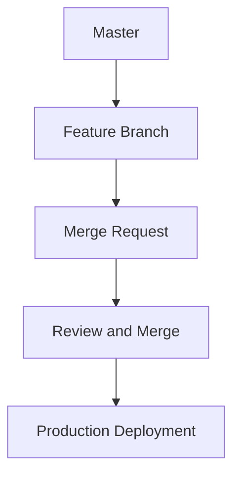

# Version Control Systems

## Version Control Systems

CountYourWords employs Git as its version control system to manage and track changes in the source code. This ensures that all modifications are recorded, allowing for collaboration among team members and easy rollback if necessary.

### Configuration

Git is configured with a `.gitignore` file to exclude unnecessary files from version control. The `.gitignore` file includes entries for compiled class files (`*.class`), IDE-specific configuration files (e.g., `.vscode/`), and temporary files (`*.tmp`). This helps keep the repository clean and focused on source code.

```plaintext
# Ignore compiled Java classes
*.class

# Ignore Visual Studio Code specific files
.vscode/

# Ignore temporary files
*.tmp
```

### Workflow

The development workflow in CountYourWords follows a standard Git branching model:

1. **Master Branch**: This branch contains the production-ready code and is protected against direct commits.
2. **Feature Branches**: Developers create feature branches for new features or bug fixes. These branches are created from the `master` branch and merged back into it once completed.
3. **Pull Requests (PRs)**: Before merging a feature branch into `master`, developers submit a pull request. This allows other team members to review the changes before they are integrated.

### Repository Structure

The repository is structured as follows:

```plaintext
CountYourWords/
├── lib/
│   ├── hamcrest-core-1.3.jar
│   └── junit-4.13.2.jar
├── readme.md
├── src/
│   ├── main/
│   │   ├── App.java
│   │   ├── CountYourWords.java
│   │   ├── Pair.java
│   │   └── Sort.java
│   └── test/
│       ├── CountYourWordsTest.java
│       ├── SortTest.java
│       └── textTests/
│           ├── emptyFile.txt
│           ├── exampleFile.txt
│           ├── nonPeriodFile.txt
│           └── validFile.txt
└── .gitignore
```

### Example Commit

Here is an example of a Git commit message for adding a new feature:

```plaintext
feat: Add word count functionality

- Implemented the `countWords` method in `CountYourWords.java`
- Added unit tests for the `countWords` method in `CountYourWordsTest.java`
```

### Mermaid Diagram

Below is a Mermaid diagram illustrating the Git branching model used in CountYourWords:



This diagram shows the flow of changes from the `master` branch to feature branches, through pull requests for review, and finally to production deployment.

### Conclusion

Git is a robust version control system that facilitates collaboration, code management, and rollback capabilities. By following the outlined configuration and workflow, CountYourWords ensures that its source code is well-organized and easily maintainable.