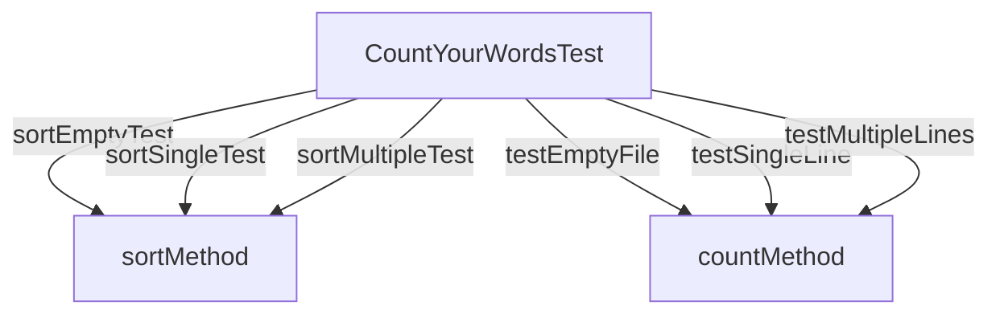

# Testing Environment

## Testing Environment

The testing environment for CountYourWords is designed to ensure that all components of the application are thoroughly tested. This includes unit tests, integration tests, and end-to-end tests. The following sections detail the setup and tools used in each type of test.

### Unit Tests

Unit tests focus on individual methods or functions within the codebase. For CountYourWords, these tests are located in the `CountYourWordsTest.java` file. The primary testing framework used is JUnit 4.13.2, which provides a robust set of annotations and utilities for writing and running tests.

#### Example Unit Test

Here is an example unit test from `CountYourWordsTest.java`:

```java
@Test
public void sortEmptyTest() {
    HashMap<String, Integer> emptyMap = new HashMap<>();
    ArrayList<String> sortedArray = CountYourWords.sort(emptyMap);
    assertTrue("Array should be empty", sortedArray.isEmpty());
}
```

This test checks that the `sort` method correctly handles an empty map of word counts.

### Integration Tests

Integration tests verify that different components of the application work together as expected. For CountYourWords, these tests are also located in the `CountYourWordsTest.java` file. The focus is on testing the interaction between methods and classes.

#### Example Integration Test

Here is an example integration test from `CountYourWordsTest.java`:

```java
@Test
public void testEmptyFile() {
    ArrayList<String> fileLines = new ArrayList<>();
    Pair result = CountYourWords.count(fileLines);

    assertEquals("Total words should be 0", 0, result.getFirst());
    assertTrue("Word counts map should be empty", result.getSecond().isEmpty());
}
```

This test checks that the `count` method correctly processes an empty file.

### End-to-End Tests

End-to-end tests simulate real-world usage of the application. For CountYourWords, these tests are located in the `textTests` directory and involve reading files and counting words.

#### Example End-to-End Test

The `textTests` directory contains several test files (`emptyFile.txt`, `exampleFile.txt`, etc.) that are used to simulate different scenarios. Here is an example of how one might write a simple script to run these tests:

```bash
java -cp .:lib/junit-4.13.2.jar:lib/hamcrest-core-1.3.jar CountYourWordsTest
```

This command runs the `CountYourWordsTest` class using JUnit, which will execute all the tests defined within it.

### Testing Environment Setup

The testing environment is set up to use the following tools and libraries:

- **JUnit 4.13.2**: The primary testing framework.
- **Hamcrest Core 1.3**: A library for writing matcher objects in Java.
- **Test Files**: Located in the `textTests` directory, these files are used to simulate different input scenarios.

### Diagrams

Below is a Mermaid diagram that illustrates the relationships between the test classes and methods:



This diagram shows how the `CountYourWordsTest` class interacts with the `sort` and `count` methods.

### Conclusion

The testing environment for CountYourWords is comprehensive, covering unit tests, integration tests, and end-to-end tests. By using JUnit 4.13.2 and Hamcrest Core 1.3, developers can ensure that all components of the application are thoroughly tested. The use of test files in the `textTests` directory allows for realistic simulation of user input scenarios.