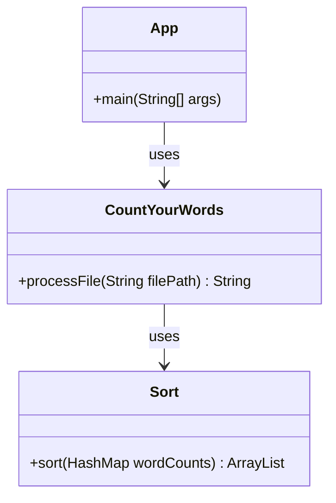

# Development Environment

## Development Environment

The development environment for CountYourWords is set up using Java, a popular programming language known for its robustness and versatility. The project utilizes several tools and frameworks to ensure efficient development, testing, and maintenance.

### Tools & Languages

- **Java**: The primary programming language used in CountYourWords.
  - **Version**: Java 11 or later (as specified in the `readme.md` file).
  - **Reasoning**: Java is chosen for its strong typing, extensive library support, and wide adoption in enterprise environments.

### Frameworks & Libraries

- **JUnit**: A widely-used testing framework for Java applications.
  - **Version**: JUnit 4.13.2 (specified in the `lib/junit-4.13.2.jar` file).
  - **Reasoning**: JUnit is essential for writing unit tests, ensuring that each component of CountYourWords functions as expected.

- **Hamcrest**: A library for creating readable and maintainable test assertions.
  - **Version**: Hamcrest-core-1.3 (specified in the `lib/hamcrest-core-1.3.jar` file).
  - **Reasoning**: Hamcrest enhances JUnit tests by providing more expressive assertion messages.

### Project Structure

The project follows a standard Maven structure, with the source code located under the `src/main/java` directory and test cases under `src/test/java`. The `lib` directory contains third-party libraries used in the project.

#### Directory Breakdown

- **`CountYourWords/lib/hamcrest-core-1.3.jar`**: Contains Hamcrest library for assertions.
- **`CountYourWords/lib/junit-4.13.2.jar`**: Contains JUnit testing framework.
- **`CountYourWords/readme.md`**: Project documentation outlining requirements and goals.
- **`CountYourWords/src/main/App.java`**: Main application class (placeholder).
- **`CountYourWords/src/main/CountYourWords.java`**: Core logic for counting words.
- **`CountYourWords/src/main/Pair.java`**: Utility class for storing pairs of values.
- **`CountYourWords/src/main/Sort.java`**: Contains sorting algorithms.
- **`CountYourWords/src/test/CountYourWordsTest.java`**: Unit tests for `CountYourWords`.
- **`CountYourWords/src/test/SortTest.java`**: Unit tests for sorting logic.
- **`CountYourWords/src/test/textTests/emptyFile.txt`**: Test file with no content.
- **`CountYourWords/src/test/textTests/exampleFile.txt`**: Sample test file.
- **`CountYourWords/src/test/textTests/nonPeriodFile.txt`**: Test file without periods.
- **`CountYourWords/src/test/textTests/validFile.txt`**: Valid test file for processing.

### Setup Instructions

To set up the development environment, follow these steps:

1. **Install Java Development Kit (JDK)**:
   - Download and install JDK 11 or later from [Oracle](https://www.oracle.com/java/technologies/javase-jdk11-downloads.html) or [OpenJDK](https://openjdk.java.net/install/).

2. **Set Up an Integrated Development Environment (IDE)**:
   - Install [Visual Studio Code](https://code.visualstudio.com/) with the Java Extension Pack.
   - Alternatively, use IntelliJ IDEA or Eclipse.

3. **Clone the Repository**:
   ```sh
   git clone https://github.com/your-repo/CountYourWords.git
   cd CountYourWords
   ```

4. **Import the Project into Your IDE**:
   - Open the project in Visual Studio Code.
   - Ensure all dependencies are correctly resolved by opening the `lib` directory and adding the JAR files to your project's classpath.

5. **Run Tests**:
   ```sh
   mvn test
   ```
   This command will execute all unit tests located under `src/test/java`.

### Example Code Snippets

#### Main Application Class (`App.java`)
```java
public class App {
    public static void main(String[] args) {
        // Entry point of the application
        CountYourWords count = new CountYourWords();
        String result = count.processFile("input.txt");
        System.out.println(result);
    }
}
```

#### Word Count Logic (`CountYourWords.java`)
```java
import java.io.BufferedReader;
import java.io.FileReader;
import java.io.IOException;
import java.util.HashMap;

public class CountYourWords {
    public String processFile(String filePath) throws IOException {
        HashMap<String, Integer> wordCounts = new HashMap<>();
        try (BufferedReader br = new BufferedReader(new FileReader(filePath))) {
            String line;
            while ((line = br.readLine()) != null) {
                // Process each line to count words
                String[] words = line.split("\\s+");
                for (String word : words) {
                    wordCounts.put(word.toLowerCase(), wordCounts.getOrDefault(word, 0) + 1);
                }
            }
        }
        return Sort.sort(wordCounts).toString();
    }
}
```

#### Sorting Logic (`Sort.java`)
```java
import java.util.ArrayList;

public class Sort {
    public static ArrayList<String> sort(HashMap<String, Integer> wordCounts) {
        ArrayList<String> sortedWordCounts = new ArrayList<>();
        // Sort the words first
        ArrayList<String> sortedWords = insertionSort(wordCounts.keySet().toArray(new String[0]));

        // Now to add the values back
        for (String word : sortedWords) {
            String value = Integer.toString(wordCounts.get(word));
            String fString = word + " " + value;
            sortedWordCounts.add(fString);
        }

        return sortedWordCounts;
    }

    private static ArrayList<String> insertionSort(String[] array) {
        // Insertion sort implementation
        for (int i = 1; i < array.length; i++) {
            String key = array[i];
            int j = i - 1;
            while (j >= 0 && array[j].compareTo(key) > 0) {
                array[j + 1] = array[j];
                j--;
            }
            array[j + 1] = key;
        }
        return new ArrayList<>(List.of(array));
    }
}
```

### Mermaid Diagram

Below is a simple Mermaid diagram illustrating the class relationships in CountYourWords:



This diagram shows the basic flow of data and method calls within the CountYourWords project.

### Conclusion

The development environment for CountYourWords is well-equipped with Java, JUnit, and Hamcrest. The project structure follows a standard Maven layout, making it easy to navigate and maintain. By following the setup instructions and utilizing the provided code snippets, developers can effectively contribute to the project's success.