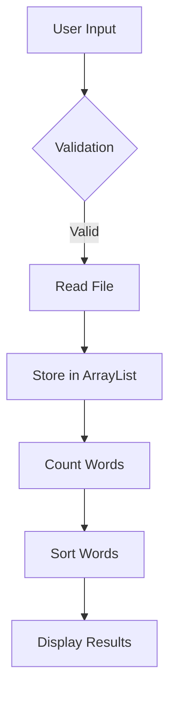

# Input Handling

## Input Handling

### Overview

User input is a crucial aspect of any application, especially one like CountYourWords that processes text files. The input handling process in CountYourWords involves receiving user input, validating it, and storing it in appropriate data structures before further processing.

### Receiving User Input

The primary method for receiving user input in CountYourWords is through the `main` method in the `App.java` file:

```java
public static void main(String[] args) throws FileNotFoundException {
    BufferedReader br = new BufferedReader(new InputStreamReader(System.in));

    System.out.print("Enter the Path : ");

    // Reading File name
    String path = "";
    try {
        path = br.readLine();
    } catch (IOException e) {
        // TODO Auto-generated catch block
        e.printStackTrace();
    }

    ArrayList<String> fileLines = CountYourWords.readFile(path);
    Pair wordTotalCount = CountYourWords.count(fileLines);
    ArrayList<String> finaList = CountYourWords.sort(wordTotalCount.getSecond());
    System.out.printf("Number of words: %d\n", wordTotalCount.getFirst());
    for (String line : finaList) {
        System.out.println(line);
    }
}
```

This method prompts the user to enter a file path and reads it from standard input. The `readFile` method in the `CountYourWords.java` class is then called with this path to read the contents of the file.

### Validating User Input

Input validation is essential to ensure that the application handles invalid or unexpected inputs gracefully. In CountYourWords, the primary validation step occurs when reading the user input:

```java
String path = "";
try {
    path = br.readLine();
} catch (IOException e) {
    // TODO Auto-generated catch block
    e.printStackTrace();
}
```

If an `IOException` is thrown during this process, it indicates that there was a problem with reading from standard input. In a production environment, you would want to handle this exception more gracefully, possibly by prompting the user again or providing an error message.

### Storing Input Data

The input data, which in this case is the contents of a text file, is stored in an `ArrayList<String>`:

```java
ArrayList<String> fileLines = CountYourWords.readFile(path);
```

This list holds each line of the file as a separate element. The `readFile` method reads the file and populates this list.

### Data Structures

The primary data structure used for storing input data in CountYourWords is an `ArrayList<String>`. This allows for efficient addition, removal, and access of elements by index. Additionally, the application uses other data structures such as `HashMap<String, Integer>` to count word occurrences and `Pair<Integer, HashMap<String, Integer>>` to store both the total word count and the word counts.

### Mermaid Diagram

Here is a mermaid diagram that illustrates the flow of data through the input handling process:



### Conclusion

The input handling process in CountYourWords is a critical part of the application's architecture. It involves receiving user input, validating it, and storing it in appropriate data structures before further processing. By understanding this process, developers can better appreciate how user inputs are managed within the application and ensure that the system handles various scenarios gracefully.