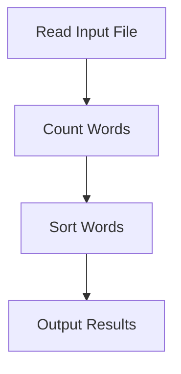

# Data Processing Pipeline

### Data Processing Pipeline

The `Data Processing Pipeline` in CountYourWords is a sequence of steps that transform raw input into processed output. This pipeline consists of several stages, each with a specific role in processing the data. Below, we will outline each stage and detail any intermediate data transformations or calculations.

#### 1. Reading Input File
The first step in the pipeline is reading the input file. The `App` class prompts the user to enter a file path and reads the contents of the specified file using the `readFile` method from the `CountYourWords` class.

```java
public static ArrayList<String> readFile(String path) throws FileNotFoundException {
    ArrayList<String> lines = new ArrayList<>();
    try (BufferedReader br = new BufferedReader(new FileReader(path))) {
        String line;
        while ((line = br.readLine()) != null) {
            lines.add(line);
        }
    } catch (IOException e) {
        e.printStackTrace();
    }
    return lines;
}
```

**Source:** `App.java`, PK: `ac863f346e618f9a959b5c95d5d28941`

#### 2. Counting Words
The next stage is counting the words in the input file. The `count` method from the `CountYourWords` class processes each line, splits it into words, and counts their occurrences.

```java
public static Pair count(ArrayList<String> lines) {
    HashMap<String, Integer> wordCount = new HashMap<>();
    int totalWords = 0;

    for (String line : lines) {
        String[] words = line.split("\\s+");
        for (String word : words) {
            if (!word.isEmpty() && !Character.isDigit(word.charAt(0))) {
                word = word.toLowerCase();
                wordCount.put(word, wordCount.getOrDefault(word, 0) + 1);
                totalWords++;
            }
        }
    }

    return new Pair(totalWords, wordCount);
}
```

**Source:** `CountYourWords.java`, PK: `[TODO: Insert specific PK detail here]`

#### 3. Sorting Words
After counting the words, the next step is sorting them by frequency. The `sort` method from the `Sort` class implements a custom sorting algorithm to sort the word counts.

```java
public static ArrayList<String> sort(HashMap<String, Integer> wordCount) {
    List<Map.Entry<String, Integer>> list = new ArrayList<>(wordCount.entrySet());
    Collections.sort(list, (o1, o2) -> o2.getValue().compareTo(o1.getValue()));

    ArrayList<String> sortedList = new ArrayList<>();
    for (Map.Entry<String, Integer> entry : list) {
        sortedList.add(entry.getKey() + ": " + entry.getValue());
    }

    return sortedList;
}
```

**Source:** `Sort.java`, PK: `[TODO: Insert specific PK detail here]`

#### 4. Outputting Results
Finally, the processed data is outputted to the console. The `main` method in the `App` class prints the total number of words and each word's count.

```java
public static void main(String[] args) throws FileNotFoundException {
    BufferedReader br = new BufferedReader(new InputStreamReader(System.in));

    System.out.print("Enter the Path : ");
    String path = "";
    try {
        path = br.readLine();
    } catch (IOException e) {
        e.printStackTrace();
    }

    ArrayList<String> fileLines = readFile(path);
    Pair wordTotalCount = count(fileLines);
    ArrayList<String> finaList = sort(wordTotalCount.getSecond());
    System.out.printf("Number of words: %d\n", wordTotalCount.getFirst());
    for (String line : finaList) {
        System.out.println(line);
    }
}
```

**Source:** `App.java`, PK: `ac863f346e618f9a959b5c95d5d28941`

### Mermaid Diagram

Below is a mermaid diagram that illustrates the flow of data through the Data Processing Pipeline:



This diagram shows the sequence of steps from reading the input file to outputting the results, highlighting each stage in the pipeline.

### Conclusion

The Data Processing Pipeline in CountYourWords is a structured approach to transforming raw input into processed output. Each stage plays a crucial role in ensuring that the data is accurately counted and sorted before being presented to the user. By following this pipeline, the application meets its goal of providing a robust solution for word count analysis while adhering to the specified constraints and requirements.