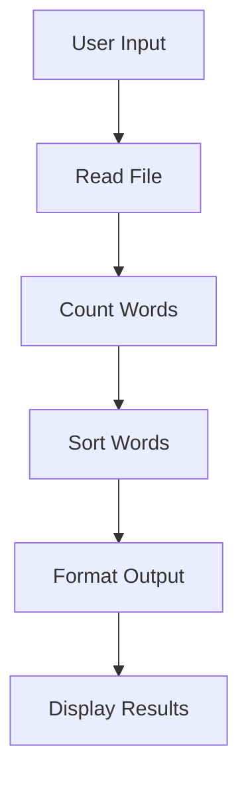

# Output Generation

### Output Generation

The `CountYourWords` project generates output based on the processed data from user-provided text files. The primary mechanism involves reading a file, counting words, sorting them by frequency, and then presenting the results in a readable format.

#### Overview of Output Generation Process

1. **File Reading**: The application prompts the user to enter a file path and reads the contents of the specified file.
2. **Data Processing**:
   - **Word Counting**: Each word is counted, and the total number of words is determined.
   - **Sorting**: Words are sorted by their frequency in descending order.
3. **Output Formatting**:
   - The results are formatted into a readable string that includes the total number of words and the sorted list of words with their frequencies.

#### Code Example

Below is an example of how the output generation process is implemented in the `App` class:

```java
public static void main(String[] args) throws FileNotFoundException {
    BufferedReader br = new BufferedReader(new InputStreamReader(System.in));

    System.out.print("Enter the Path : ");
    
    // Reading File name
    String path = "";
    try {
        path = br.readLine();
    } catch (IOException e) {
        // TODO Auto-generated catch block
        e.printStackTrace();
    }

    ArrayList<String> fileLines = CountYourWords.readFile(path);
    Pair wordTotalCount = CountYourWords.count(fileLines);
    ArrayList<String> finaList = CountYourWords.sort(wordTotalCount.getSecond());
    System.out.printf("Number of words: %d\n", wordTotalCount.getFirst());
    for (String line : finaList) {
        System.out.println(line);
    }
}
```

#### Explanation

1. **File Reading**:
   - The application reads the file path from the user.
   - It then reads the contents of the file into an `ArrayList<String>`.

2. **Data Processing**:
   - The `CountYourWords.count` method processes the list of lines to count the occurrences of each word.
   - The `CountYourWords.sort` method sorts these words by their frequency in descending order.

3. **Output Formatting**:
   - The results are printed to the console, showing the total number of words and a sorted list of words with their frequencies.

#### Mermaid Diagram

Below is a mermaid diagram that illustrates the flow of data through the output generation process:



#### Notes

- The `App` class is the entry point of the application, handling user input and displaying the results.
- The `CountYourWords` class contains methods for reading files, counting words, and sorting them.
- The output is formatted as plain text, but additional mechanisms (e.g., reports, summaries, visualizations) could be implemented to enhance the user experience.

This section provides a comprehensive overview of how processed data is formatted and prepared for delivery in the `CountYourWords` project.