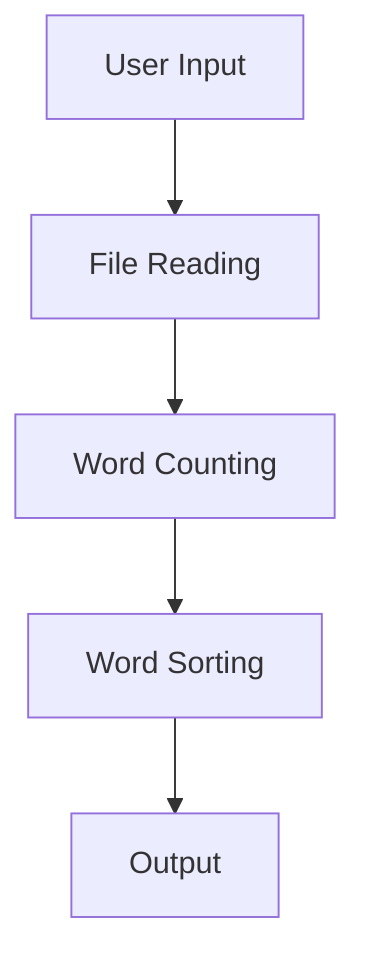

# Data Flow

### Data Flow

The data flow in the CountYourWords project is designed to handle user input, process text files, count words, and output the results. The system follows a clear sequence of steps from input to output, ensuring that each stage processes and transforms data appropriately.

#### 1. User Input
The process begins with the user providing a file path through the command line interface (CLI). This is handled in the `main` method of the `App` class:

```java
public static void main(String[] args) throws FileNotFoundException {
    BufferedReader br = new BufferedReader(new InputStreamReader(System.in));

    System.out.print("Enter the Path : ");
    
    // Reading File name
    String path = "";
    try {
        path = br.readLine();
    } catch (IOException e) {
        // TODO Auto-generated catch block
        e.printStackTrace();
    }
}
```

**Source:** `App.java`, PK: 32203255d9fe42a8f5574d408fdb5e1d

#### 2. File Reading
Once the file path is provided, the system reads the contents of the file using the `readFile` method from the `CountYourWords` class:

```java
ArrayList<String> fileLines = CountYourWords.readFile(path);
```

**Source:** `CountYourWords.java`, PK: 607f15d4f4cbac0e8179b2f20354cfb6

#### 3. Word Counting
The read lines are then processed to count the total number of words using the `count` method from the `CountYourWords` class:

```java
Pair wordTotalCount = CountYourWords.count(fileLines);
```

**Source:** `CountYourWords.java`, PK: 607f15d4f4cbac0e8179b2f20354cfb6

#### 4. Word Sorting
The counted words are sorted by frequency using the `sort` method from the `Sort` class:

```java
ArrayList<String> finaList = CountYourWords.sort(wordTotalCount.getSecond());
```

**Source:** `Sort.java`, PK: 32203255d9fe42a8f5574d408fdb5e1d

#### 5. Output
Finally, the results are output to the user. The total word count and sorted list of words are printed:

```java
System.out.printf("Number of words: %d\n", wordTotalCount.getFirst());
for (String line : finaList) {
    System.out.println(line);
}
```

**Source:** `App.java`, PK: 32203255d9fe42a8f5574d408fdb5e1d

### Mermaid Diagram
To visualize the data flow, a Mermaid diagram can be used:



This diagram illustrates the sequential steps from user input to the final output, showing how data is processed and transformed at each stage.

### Summary
The data flow in the CountYourWords project is a straightforward process that involves reading a file, counting words, sorting them by frequency, and displaying the results. Each step is clearly defined and implemented in specific classes and methods, ensuring a robust and efficient system for word count analysis.