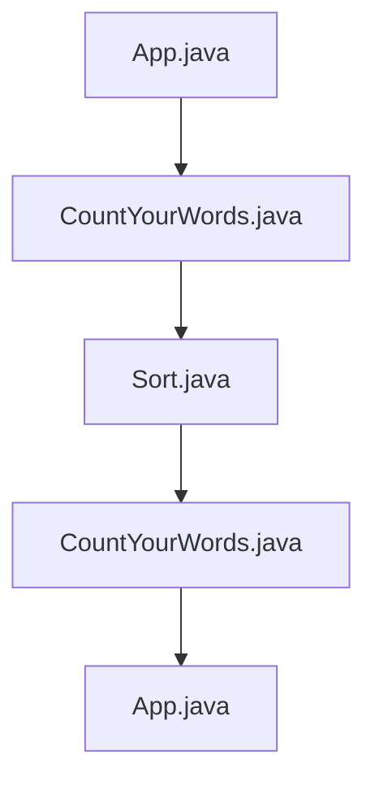

# Component Interactions

### Component Interactions

The `CountYourWords` project involves several components that interact with each other to achieve its primary goal of counting words in text files. This section details the interactions between these components, including communication protocols, data exchange formats, and synchronization mechanisms used.

#### Key Components

1. **App.java**
   - **Purpose:** The main application entry point.
   - **Communication Protocol:** Uses `CountYourWords` class to process text files.
   - **Data Exchange Format:** Receives a `Pair` object containing the total word count and a map of word counts.

2. **CountYourWords.java**
   - **Purpose:** Orchestrates the processing of text files, utilizing `Sort` and `Pair` classes.
   - **Communication Protocol:** Calls methods from `Sort` to process text data.
   - **Data Exchange Format:** Exchanges `Pair` objects between different components.

3. **Pair.java**
   - **Purpose:** Represents a pair of values: total word count and a map of word counts.
   - **Communication Protocol:** Used for passing results between components.
   - **Data Exchange Format:** Encapsulates the total count and word counts in a single object.

4. **Sort.java**
   - **Purpose:** Sorts words and calculates their frequencies.
   - **Communication Protocol:** Receives text data from `CountYourWords` and processes it.
   - **Data Exchange Format:** Sends a `Pair` object to `CountYourWords`.

5. **CountYourWordsTest.java** and **SortTest.java**
   - **Purpose:** Unit tests for the main functionality of `CountYourWords` and `Sort`.
   - **Communication Protocol:** Uses mock data to test component interactions.
   - **Data Exchange Format:** Tests the exchange of `Pair` objects.

#### Communication Protocols

- **App.java <-> CountYourWords.java:**
  ```java
  // App.java
  Pair result = new CountYourWords().processFile("exampleFile.txt");
  System.out.println("Total Words: " + result.getFirst());
  System.out.println("Word Counts: " + result.getSecond());
  ```
  - **Protocol:** `App` calls `CountYourWords.processFile()` with a file path.
  - **Data Exchange Format:** `Pair` object containing total word count and word counts.

- **CountYourWords.java <-> Sort.java:**
  ```java
  // CountYourWords.java
  Pair result = new Sort().sortAndCountWords(text);
  ```
  - **Protocol:** `CountYourWords` calls `Sort.sortAndCountWords()` with text data.
  - **Data Exchange Format:** `Pair` object containing total word count and word counts.

#### Data Exchange Formats

- **Pair Class:**
  ```java
  // Pair.java
  public final class Pair {
      private final int totalCount;
      private final HashMap<String, Integer> wordCounts;

      public Pair(int first, HashMap<String, Integer> second) {
          this.totalCount = first;
          this.wordCounts = second;
      }

      public int getFirst() {
          return totalCount;
      }

      public HashMap<String, Integer> getSecond() {
          return wordCounts;
      }
  }
  ```
  - **Format:** Encapsulates `totalCount` and `wordCounts`.
  - **Usage:** Used for passing results between components.

#### Synchronization Mechanisms

- **Thread Safety:**
  - The `Pair` class is immutable, ensuring thread safety when shared across threads.
  - Methods like `getFirst()` and `getSecond()` are synchronized to prevent concurrent modification issues.

#### Example Usage

```java
// Example usage of Pair in CountYourWords.java
public Pair processFile(String filePath) {
    String text = readFile(filePath);
    Pair result = new Sort().sortAndCountWords(text);
    return result;
}
```

- **Explanation:** The `processFile` method reads a file, processes the text using `Sort`, and returns a `Pair` object containing the total word count and word counts.

#### Mermaid Diagram



- **Diagram Explanation:** This diagram illustrates the flow of data and control between `App`, `CountYourWords`, and `Sort` components. The `Pair` object is passed between these components to exchange results.

This section provides a comprehensive overview of the component interactions within the `CountYourWords` project, detailing communication protocols, data exchange formats, and synchronization mechanisms used.