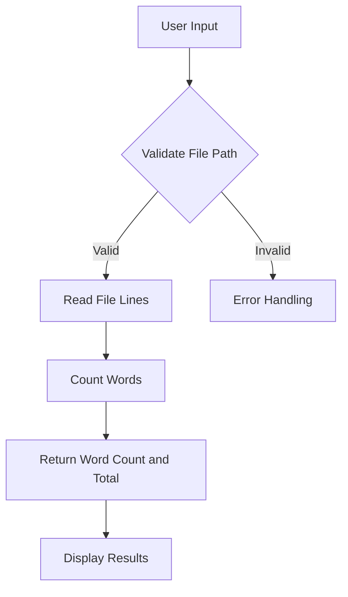

# Input Processing

### Input Processing

User input in CountYourWords is received through a simple command-line interface. The process involves reading the file path provided by the user, validating it, and then preparing the text data for word counting.

#### Receiving User Input

The user input is handled in the `App.java` class within the `main` method:

```java
public static void main(String[] args) throws FileNotFoundException {
    BufferedReader br = new BufferedReader(new InputStreamReader(System.in));

    System.out.print("Enter the Path : ");
    
    // Reading File name
    String path = "";
    try {
        path = br.readLine();
    } catch (IOException e) {
        // TODO Auto-generated catch block
        e.printStackTrace();
    }
}
```

This code snippet reads a file path from the user and stores it in the `path` variable. The `BufferedReader` is used to handle input from the standard input stream.

#### Validating User Input

The validation of the user-provided file path is implicitly handled by the subsequent method calls that attempt to read the file:

```java
ArrayList<String> fileLines = CountYourWords.readFile(path);
```

If the file does not exist or cannot be accessed, a `FileNotFoundException` will be thrown. This exception handling ensures that only valid file paths are processed.

#### Preparing Input for Word Counting

Once the file is successfully read, the lines of text are passed to the `count` method in the `CountYourWords.java` class:

```java
Pair wordTotalCount = CountYourWords.count(fileLines);
```

The `count` method processes each line of text, counting the occurrences of each word. It uses a `HashMap<String, Integer>` to store the word counts.

#### Data Structures Used

The primary data structure used in this section is the `HashMap<String, Integer>`. This map stores words as keys and their respective counts as values. The `Pair` class is also used to encapsulate two pieces of related information: the total number of words and the word count map:

```java
public final class Pair {
    private final int totalCount;
    private final HashMap<String, Integer> wordCounts;

    public Pair(int first, HashMap<String, Integer> second) {
        this.totalCount = first;
        this.wordCounts = second;
    }

    public int getFirst() {
        return totalCount;
    }

    public HashMap<String, Integer> getSecond() {
        return wordCounts;
    }
}
```

The `Pair` class provides a convenient way to return two values from the `count` method.

#### Mermaid Diagram

Here is a mermaid diagram that illustrates the flow of data through the Input Processing section:



This diagram shows the sequence of operations from user input to displaying the word count results.

### Conclusion

The Input Processing section in CountYourWords handles user input, validates it, and prepares the text data for word counting. The use of `HashMap<String, Integer>` and the `Pair` class ensures that the word counts are efficiently stored and returned.