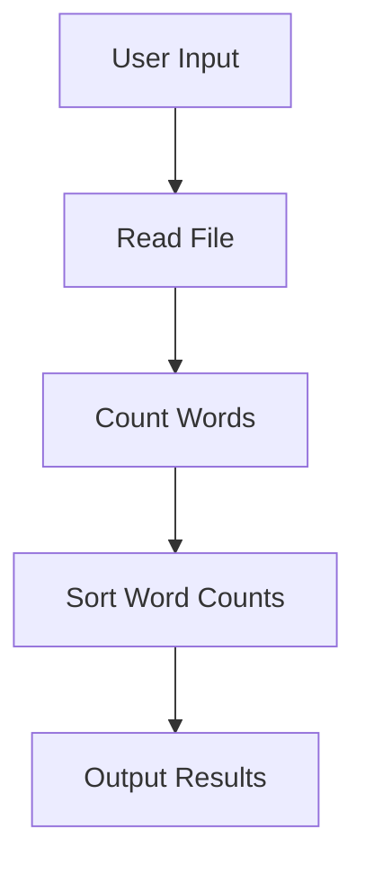

# Output Generation

### Output Generation

The `Output Generation` section of CountYourWords is responsible for formatting and presenting the word count results to the user. This process involves several key steps, including sorting and filtering the word counts before final presentation.

#### Sorting Word Counts

Word counts are sorted based on their frequency in descending order. The sorting logic is implemented in the `Sort.java` file. Below is a code snippet demonstrating the sorting method:

```java
public class Sort {
    public static ArrayList<String> sort(HashMap<String, Integer> wordCounts) {
        // Convert HashMap to List of entries
        List<Map.Entry<String, Integer>> list = new ArrayList<>(wordCounts.entrySet());
        
        // Sort the list based on value (frequency)
        Collections.sort(list, new Comparator<Map.Entry<String, Integer>>() {
            public int compare(Map.Entry<String, Integer> o1, Map.Entry<String, Integer> o2) {
                return (o2.getValue()).compareTo(o1.getValue());
            }
        });
        
        // Convert sorted list back to ArrayList of strings
        ArrayList<String> sortedList = new ArrayList<>();
        for (Map.Entry<String, Integer> entry : list) {
            sortedList.add(entry.getKey() + " " + entry.getValue());
        }
        
        return sortedList;
    }
}
```

**Explanation:**
1. **Conversion to List:** The `HashMap` of word counts is converted into a `List` of entries.
2. **Sorting:** The list is sorted using `Collections.sort()` with a custom comparator that compares the values (frequencies) in descending order.
3. **Conversion Back to ArrayList:** The sorted list is then converted back into an `ArrayList<String>` where each element represents a word and its count.

#### Filtering Word Counts

Filtering is not explicitly implemented in the current version of CountYourWords, but it could be added if needed. For example, one might want to filter out words that appear less than a certain number of times or exclude common stop words.

#### Presentation of Results

The final step in output generation is presenting the sorted word counts to the user. This is handled by the `main` method in the `App.java` file:

```java
public class App {
    public static void main(String[] args) throws FileNotFoundException {
        BufferedReader br = new BufferedReader(new InputStreamReader(System.in));

        System.out.print("Enter the Path : ");

        // Reading File name
        String path = "";
        try {
            path = br.readLine();
        } catch (IOException e) {
            // TODO Auto-generated catch block
            e.printStackTrace();
        }

        ArrayList<String> fileLines = CountYourWords.readFile(path);
        Pair wordTotalCount = CountYourWords.count(fileLines);
        ArrayList<String> finaList = Sort.sort(wordTotalCount.getSecond());
        System.out.printf("Number of words: %d\n", wordTotalCount.getFirst());
        for (String line : finaList) {
            System.out.println(line);
        }
    }
}
```

**Explanation:**
1. **User Input:** The user is prompted to enter the file path.
2. **File Reading and Counting:** The `readFile` method reads the file, and the `count` method counts the words.
3. **Sorting:** The word counts are sorted using the `Sort.sort()` method.
4. **Output:** The total number of words and the sorted list are printed to the console.

#### Mermaid Diagram

Below is a mermaid diagram that illustrates the flow of data through the output generation process:



**Explanation:**
1. **User Input:** The user provides a file path.
2. **Read File:** The file is read and its contents are stored in an `ArrayList`.
3. **Count Words:** The word counts are calculated using the `count` method.
4. **Sort Word Counts:** The word counts are sorted based on frequency.
5. **Output Results:** The total number of words and the sorted list are displayed to the user.

This structured approach ensures that the word count results are presented in a clear, organized manner, making it easy for users to understand the distribution of words in their text files.