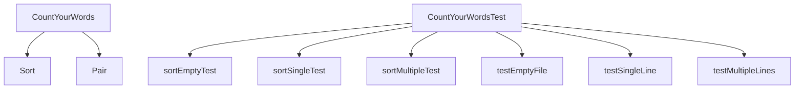

# Unit Testing Tools

## Unit Testing Tools

CountYourWords uses a robust suite of unit testing tools to ensure the reliability and correctness of its components. The primary tools used are JUnit 4.13.2 and Hamcrest Core 1.3, which provide comprehensive support for writing and running tests.

### JUnit 4.13.2

JUnit is a widely-used framework for writing repeatable tests in Java. It provides annotations to define test methods and lifecycle callbacks that allow developers to set up and tear down test environments before and after each test.

#### Key Features of JUnit
- **Annotations:** `@Test` marks a method as a test case.
- **Assertions:** Methods like `assertEquals`, `assertTrue`, and `assertFalse` are used to validate the expected outcomes.
- **Setup and Teardown:** `@Before` and `@After` annotations allow for code to run before and after each test, respectively.

#### Example JUnit Test
```java
@Test
public void sortEmptyTest() {
    HashMap<String, Integer> emptyMap = new HashMap<>();
    ArrayList<String> sortedArray = CountYourWords.sort(emptyMap);
    assertTrue("Array should be empty", sortedArray.isEmpty());
}
```

### Hamcrest Core 1.3

Hamcrest is a library that provides matchers for assertions in JUnit and other testing frameworks. It allows for more expressive and readable test conditions.

#### Key Features of Hamcrest
- **Matchers:** Predicates that can be used to check the properties of objects.
- **Readability:** Provides a fluent API for constructing complex assertions.

#### Example Hamcrest Matcher
```java
assertThat(sortedArray, empty());
```

### Integration into Development Process

Unit tests are integrated into the development process through several key practices:
1. **Automated Build:** Tests are run automatically as part of the build process using tools like Maven or Gradle.
2. **Continuous Integration (CI):** Tests are executed on every code commit to ensure that changes do not break existing functionality.
3. **Code Coverage:** Tools like JaCoCo measure test coverage, helping developers identify untested parts of their code.

### Example Project Structure

The project structure includes specific directories and files dedicated to unit testing:
```
CountYourWords/
├── lib/
│   ├── hamcrest-core-1.3.jar
│   └── junit-4.13.2.jar
├── src/
│   ├── main/
│   │   ├── App.java
│   │   ├── CountYourWords.java
│   │   ├── Pair.java
│   │   └── Sort.java
│   └── test/
│       ├── CountYourWordsTest.java
│       ├── SortTest.java
│       └── textTests/
│           ├── emptyFile.txt
│           ├── exampleFile.txt
│           ├── nonPeriodFile.txt
│           └── validFile.txt
```

### Mermaid Diagram

Below is a mermaid diagram illustrating the dependency relationships between the main classes and test classes in CountYourWords:



This diagram shows how the `CountYourWords` class interacts with its components and how each test method in `CountYourWordsTest` exercises specific functionalities.

### Conclusion

The use of JUnit 4.13.2 and Hamcrest Core 1.3 ensures that CountYourWords is thoroughly tested, providing confidence in its reliability and functionality. The integration into the development process through automated builds and continuous integration further enhances the quality assurance efforts.